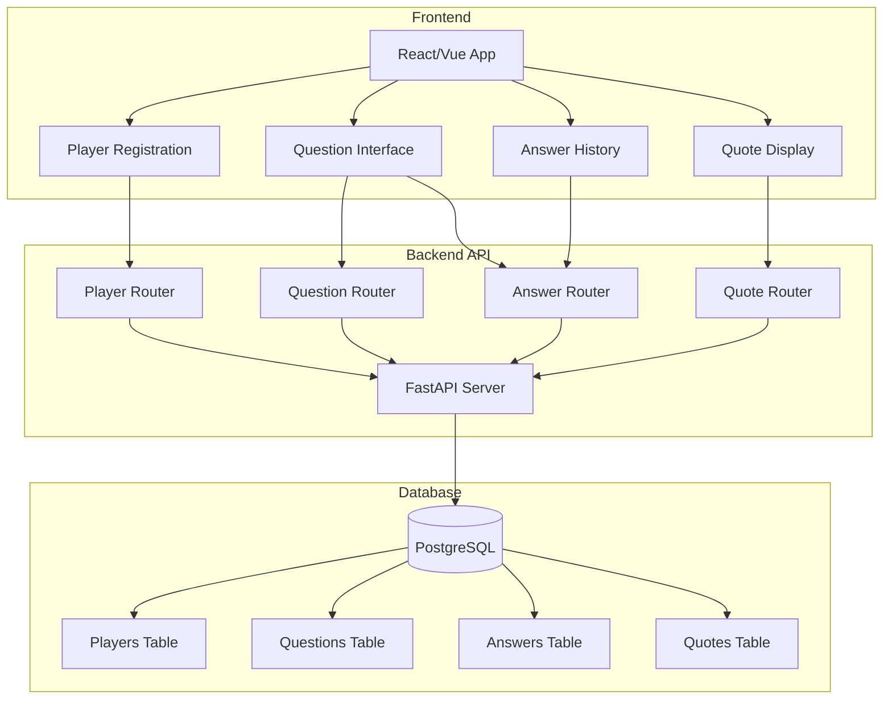
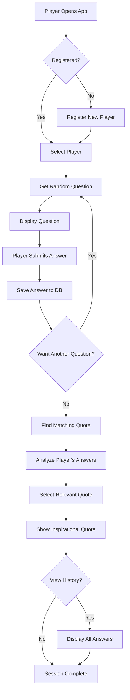
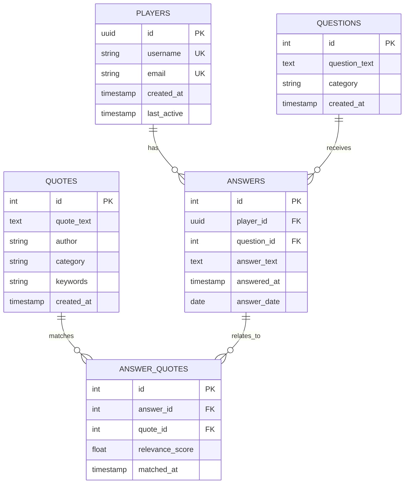
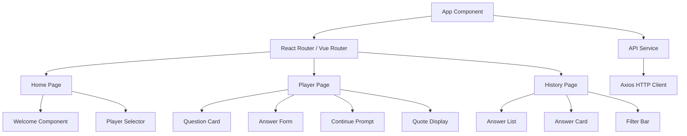
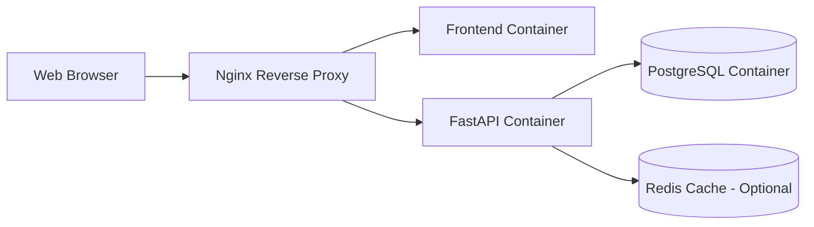

# Daily Question Web App - Architecture

## System Architecture



## Enhanced User Flow



## Database Schema (Updated)



## API Architecture

### Endpoint Structure

```
/api/v1/
├── /players
│   ├── POST   /              Create player
│   ├── GET    /              List all players
│   ├── GET    /{id}          Get player details
│   ├── PUT    /{id}          Update player
│   └── DELETE /{id}          Delete player
│
├── /questions
│   ├── GET    /              List all questions
│   ├── GET    /random        Get random question
│   ├── GET    /random/{player_id}  Get question for player (excludes recent)
│   ├── POST   /              Create question (admin)
│   └── GET    /{id}          Get specific question
│
├── /answers
│   ├── POST   /              Submit answer
│   ├── GET    /player/{id}   Get player's all answers
│   ├── GET    /player/{id}/today  Get today's answers
│   └── GET    /{id}          Get specific answer
│
└── /quotes
    ├── GET    /              List all quotes
    ├── GET    /random        Get random quote
    ├── GET    /match/{player_id}  Get quote matching player's answers
    └── POST   /              Create quote (admin)
```

## Component Architecture (Frontend)



## Data Flow

### Answering Questions Flow

1. **Player Selection**: Frontend sends player ID to backend
2. **Get Question**: Backend queries questions table, excludes recently answered (last 30 days)
3. **Display Question**: Frontend shows question in UI
4. **Submit Answer**: Player types answer, frontend sends to backend
5. **Save Answer**: Backend creates answer record with player_id, question_id, answer_text, timestamp
6. **Continue Prompt**: Frontend asks if player wants another question
7. **Repeat or Quote**: If yes, repeat from step 2; if no, proceed to quote matching

### Quote Matching Flow

1. **Fetch Answers**: Backend retrieves player's recent answers (last 7 days or all)
2. **Analyze Content**: Extract keywords and themes from answers
3. **Match Quotes**: Query quotes table for matching keywords/categories
4. **Score Relevance**: Calculate relevance score based on keyword overlap
5. **Select Best Quote**: Choose highest scoring quote
6. **Return Quote**: Send quote to frontend for display

## Technology Stack Details

### Backend Dependencies
```
fastapi==0.104.1
uvicorn[standard]==0.24.0
sqlalchemy==2.0.23
psycopg2-binary==2.9.9
pydantic==2.5.0
python-dotenv==1.0.0
alembic==1.12.1
```

### Frontend Dependencies (React)
```
react==18.2.0
react-dom==18.2.0
react-router-dom==6.20.0
axios==1.6.2
@tanstack/react-query==5.8.4
tailwindcss==3.3.5
```

### Frontend Dependencies (Vue)
```
vue==3.3.8
vue-router==4.2.5
axios==1.6.2
pinia==2.1.7
tailwindcss==3.3.5
```

## Security Considerations

1. **Input Validation**: All user inputs validated with Pydantic schemas
2. **SQL Injection Prevention**: SQLAlchemy ORM prevents SQL injection
3. **CORS Configuration**: Properly configured CORS for frontend-backend communication
4. **Environment Variables**: Sensitive data stored in .env files
5. **Rate Limiting**: Optional rate limiting for API endpoints
6. **Data Sanitization**: HTML/script tag sanitization for user-generated content

## Performance Optimization

1. **Database Indexing**: Indexes on player_id, question_id, answer_date
2. **Connection Pooling**: SQLAlchemy connection pool for efficient DB access
3. **Caching**: Optional Redis caching for frequently accessed data
4. **Pagination**: Paginated responses for large datasets
5. **Lazy Loading**: Frontend lazy loads components and data
6. **Query Optimization**: Efficient SQL queries with proper joins

## Deployment Architecture



## Development Workflow

1. **Local Development**:
   - Backend: `uvicorn app.main:app --reload`
   - Frontend: `npm run dev` or `yarn dev`
   - Database: Docker PostgreSQL container

2. **Testing**:
   - Backend: pytest for API tests
   - Frontend: Jest/Vitest for component tests
   - Integration: End-to-end tests with Playwright

3. **Production**:
   - Docker Compose orchestration
   - Environment-specific configurations
   - Automated backups for PostgreSQL

## Scalability Considerations

1. **Horizontal Scaling**: Multiple FastAPI instances behind load balancer
2. **Database Replication**: PostgreSQL read replicas for heavy read operations
3. **Caching Layer**: Redis for session management and frequently accessed data
4. **CDN**: Static assets served via CDN
5. **Microservices**: Future split into separate services (auth, questions, quotes)

## Monitoring & Logging

1. **Application Logs**: Structured logging with Python logging module
2. **Access Logs**: Nginx access logs for request tracking
3. **Error Tracking**: Optional Sentry integration
4. **Performance Monitoring**: Optional APM tools (New Relic, DataDog)
5. **Database Monitoring**: PostgreSQL query performance tracking

## Future Enhancements

1. **AI-Powered Quote Matching**: Use NLP/ML for better quote-answer matching
2. **Sentiment Analysis**: Analyze answer sentiment for better quote selection
3. **Social Features**: Share answers, follow other players
4. **Gamification**: Streaks, badges, achievements
5. **Mobile Apps**: Native iOS/Android apps
6. **Real-time Features**: WebSocket for live updates
7. **Analytics Dashboard**: Admin dashboard for insights
8. **Multi-language Support**: i18n for global audience