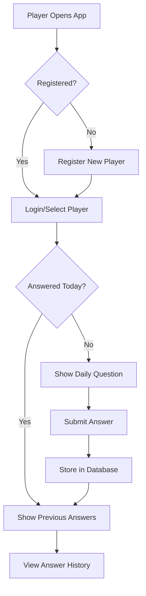

# Daily Question Web App - Project Plan

## Overview
A full-stack web application where players answer a random question each day. Built with FastAPI backend, PostgreSQL database, and React/Vue.js frontend.

## Technology Stack

### Backend
- **Framework**: FastAPI (Python 3.9+)
- **Database**: PostgreSQL
- **ORM**: SQLAlchemy
- **Authentication**: JWT tokens (optional for MVP)
- **API Documentation**: Auto-generated with FastAPI (Swagger UI)

### Frontend
- **Framework**: React or Vue.js (user's choice)
- **HTTP Client**: Axios
- **State Management**: React Context/Redux or Vue Pinia
- **Styling**: CSS/Tailwind CSS

### DevOps
- **Containerization**: Docker & Docker Compose
- **Environment Management**: python-dotenv

## Database Schema

### Tables

#### players
- id (Primary Key, UUID)
- username (Unique, String)
- email (Unique, String)
- created_at (Timestamp)
- last_active (Timestamp)

#### questions
- id (Primary Key, Integer)
- question_text (Text)
- category (String, optional)
- created_at (Timestamp)

#### answers
- id (Primary Key, Integer)
- player_id (Foreign Key -> players.id)
- question_id (Foreign Key -> questions.id)
- answer_text (Text)
- answered_at (Timestamp)
- date (Date) - for tracking daily questions

### Relationships
- One player can have many answers (1:N)
- One question can have many answers (1:N)
- A player can answer several questions every day


## API Endpoints

### Player Management
- `POST /api/players` - Create new player
- `GET /api/players/{player_id}` - Get player details
- `GET /api/players` - List all players
- `PUT /api/players/{player_id}` - Update player info
- `DELETE /api/players/{player_id}` - Delete player

### Questions
- `GET /api/questions/daily/{player_id}` - Get today's question for player
- `POST /api/questions` - Add new question (admin)
- `GET /api/questions` - List all questions

### Answers
- `POST /api/answers` - Submit answer to daily question
- `GET /api/answers/player/{player_id}` - Get player's answer history
- `GET /api/answers/player/{player_id}/today` - Check if answered today

## Application Flow



## Daily Question Logic

1. Check if player has answered today (query answers table for player_id + today's date)
2. If not answered:
   - Select random question from questions table
   - Exclude questions answered in last 30 days (to avoid repetition)
   - Return question to frontend
3. If already answered:
   - Ask if he wants to answer another question
   - If Yes go to 2
   - If No show a daily quote that agrees with one of his old answers

## Project Structure

```
DummyPythonApp/
├── backend/
│   ├── app/
│   │   ├── __init__.py
│   │   ├── main.py              # FastAPI app entry point
│   │   ├── database.py          # Database connection
│   │   ├── models.py            # SQLAlchemy models
│   │   ├── schemas.py           # Pydantic schemas
│   │   ├── crud.py              # Database operations
│   │   ├── routers/
│   │   │   ├── __init__.py
│   │   │   ├── players.py       # Player endpoints
│   │   │   ├── questions.py     # Question endpoints
│   │   │   └── answers.py       # Answer endpoints
│   │   └── utils.py             # Helper functions
│   ├── requirements.txt
│   ├── .env.example
│   └── init_db.py               # Database initialization
├── frontend/
│   ├── src/
│   │   ├── components/
│   │   │   ├── PlayerForm.jsx
│   │   │   ├── DailyQuestion.jsx
│   │   │   └── AnswerHistory.jsx
│   │   ├── services/
│   │   │   └── api.js           # API calls
│   │   ├── App.jsx
│   │   └── main.jsx
│   ├── package.json
│   └── vite.config.js
├── docker-compose.yml
├── README.md
└── PLAN.md
```

## Implementation Steps

### Phase 1: Backend Setup
1. Create project structure
2. Set up virtual environment
3. Install dependencies
4. Configure database connection
5. Create SQLAlchemy models
6. Implement database initialization

### Phase 2: API Development
1. Create Pydantic schemas for validation
2. Implement CRUD operations
3. Build API endpoints
4. Add daily question logic
5. Test endpoints with Swagger UI

### Phase 3: Frontend Development
1. Initialize React/Vue project
2. Create component structure
3. Build player registration form
4. Implement daily question interface
5. Create answer history view
6. Connect to backend API

### Phase 4: Integration & Testing
1. Test full user flow
2. Add error handling
3. Improve UI/UX
4. Add loading states

### Phase 5: Deployment Preparation
1. Create Docker configuration
2. Write comprehensive README
3. Add environment variable examples
4. Document API endpoints

## Sample Questions Bank

The app will include diverse questions such as:
- "What made you smile today?"
- "What's one thing you learned recently?"
- "If you could have dinner with anyone, who would it be?"
- "What's your favorite childhood memory?"
- "What are you grateful for today?"
- "What's a skill you'd like to learn?"
- "What's your biggest accomplishment this week?"
- "What book/movie/show are you enjoying?"
- "What's your dream vacation destination?"
- "What's one thing you'd change about the world?"

## Key Features

1. **Daily Question System**: Ensures each player gets at least one random question per day
2. **Answer History**: Players can view all their previous answers
3. **Question Variety**: Large question bank to minimize repetition
4. **Simple Registration**: Easy player onboarding
5. **RESTful API**: Clean, documented API endpoints
6. **Modern Frontend**: Responsive, user-friendly interface
7. **Docker Support**: Easy deployment and development setup

## Future Enhancements (Post-MVP)

- User authentication with JWT
- Question categories and filtering
- Social features (share answers, see friends' answers)
- Streak tracking (consecutive days answered)
- Custom questions from users
- Email/push notifications for daily reminders
- Analytics dashboard
- Multi-language support

## Development Timeline Estimate

- Backend Setup: 2-3 hours
- API Development: 3-4 hours
- Frontend Development: 4-5 hours
- Integration & Testing: 2-3 hours
- Documentation: 1-2 hours

**Total**: ~12-17 hours for a complete MVP

## Getting Started

Once implementation begins, developers should:
1. Install PostgreSQL locally or use Docker
2. Set up Python virtual environment
3. Install backend dependencies
4. Initialize database with sample data
5. Start FastAPI development server
6. Set up frontend project
7. Run frontend development server
8. Test the complete flow

## Success Criteria

- ✅ Players can register with username and email
- ✅ Each player receives one random question per day
- ✅ Players can submit answers to daily questions
- ✅ Players can view their answer history
- ✅ Questions don't repeat within 30 days for same player
- ✅ API is documented and testable via Swagger UI
- ✅ Frontend is responsive and user-friendly
- ✅ Application can be run with Docker Compose